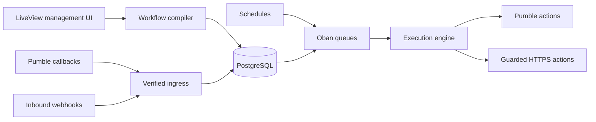

# Pumble Workflow Automation

[](https://github.com/apet97/elixperiment/actions/workflows/ci.yml)

Durable workflow execution for Pumble events, schedules, inbound webhooks, and
controlled external actions. The application is built with Phoenix LiveView,
PostgreSQL, and Oban.

> [!IMPORTANT]
> This is an independent software experiment. It is not affiliated with,
> endorsed by, sponsored by, or maintained by Pumble or CAKE.com. Product and
> company names identify the compatible service only.

[Use cases](#use-cases) · [Architecture](#architecture) ·
[Run locally](#run-locally) · [Verification](#verification) ·
[Documentation](docs/README.md)

## Current status

This repository contains a cohesive application and its verification tooling.
The proof boundaries are deliberately separate:

| Boundary | Current evidence |
| --- | --- |
| Application, database, UI, release, and container | Implemented. `./scripts/verify.sh` produces an exact-commit offline receipt. |
| Pumble API-key access | A bounded, read-only preflight has passed in one sacrificial workspace. It creates no resources. |
| OAuth installation, signed callbacks, events, interactions, and Pumble writes | Implemented against fixtures, but not live-certified with application credentials. |
| Deployed instance | No deployment is configured or proven by this repository. |
| Marketplace publication | Outside this repository's scope. |

An API key is not an OAuth client secret, application key, callback-signing
secret, installation grant, or Marketplace authority. A local boot proves only
the local application; it does not prove a real Pumble installation.

## Use cases

| Scenario | Example workflow |
| --- | --- |
| Scheduled reminders | Every weekday at 09:00 → post a channel reminder. |
| Incident routing | Signed inbound webhook → inspect severity → notify the appropriate channel. |
| Human approval | Request received → send approval controls → continue, reject, or time out. |
| Message-driven automation | Selected event or shortcut → apply conditions → reply, react, or send a direct message. |
| Controlled HTTP handoff | Trigger → call an allowlisted HTTPS endpoint → branch on the bounded response. |
| Operational recovery | Ambiguous external result → pause as `PAUSED_UNCERTAIN` → require an explicit operator decision. |

## What is implemented

Triggers include selected Pumble events, fixed slash and shortcut entry points,
once/interval/daily/weekly schedules, tenant-scoped inbound webhooks, browser dry
runs, and explicit live tests.

Workflow nodes include conditions, branching, delays, approvals, stop, Pumble
message/reply/direct-message/reaction actions, and a guarded HTTP request. Active
workflows use immutable, versioned graphs. Dynamic menus select an eligible
workflow; they do not execute work inside the callback request.

The complete v1 boundary and non-goals are in the
[product contract](docs/contract/product_contract.md).

## Architecture



PostgreSQL is the system of record. Oban supplies durable work. The execution
engine provides honest at-least-once semantics: it does not claim that a
callback, job attempt, or remote side effect happens exactly once. If a
non-idempotent write may have succeeded but its result is unknown, execution
stops in `PAUSED_UNCERTAIN` instead of retrying silently.

## Security boundaries

- Every tenant-owned lookup is scoped to one installation.
- Pumble tokens, HTTP credentials, user secrets, and webhook secrets are
  encrypted at rest and write-only in the UI.
- Callback signatures are checked against the exact raw body.
- Workflow definitions have a closed schema and compile to immutable versions.
- Duplicate and stale jobs cannot advance durable state twice.
- External HTTP actions enforce DNS/IP policy, connection pinning, redirect
  revalidation, response limits, and redaction.
- Browser mutations use revocable sessions, role checks, CSRF protection, and
  explicit destructive confirmations.

See [delivery semantics](docs/architecture/delivery_semantics.md), the
[implemented threat model](docs/security/threat_model.md), and the
[security review record](docs/security/review_results.md) for the exact claims
and residual risks.

## Run locally

The proven local toolchain is Elixir 1.20.3, Erlang/OTP 29, and PostgreSQL 16.

```bash
mix setup
mix phx.server
```

Open <http://localhost:4000>. Development and test use local placeholder
credentials from Mix configuration; they do not need a filled `.env`.

For database setup, health checks, and troubleshooting, see the
[local development runbook](docs/operations/local_development.md).

## Verification

Run the complete candidate gate from a clean commit:

```bash
./scripts/verify.sh
```

The 19-gate check covers formatting, compilation, tests, static analysis,
dependency advisories, assets, generated-file drift, LiveView acceptance,
secret scanning, a production release, release migrations, and the hardened
container. The container is built without cache, labeled with `HEAD`, scanned
for high and critical vulnerabilities, run as a numeric non-root user on a
read-only filesystem, migrated against a disposable database, and checked for
liveness and readiness.

The command needs the repository toolchain plus Docker, Trivy, `jq`, and
gitleaks. It writes a redacted receipt under `tmp/`. That receipt proves only
the exact clean commit it names. It is not live API or deployment evidence.

`mix precommit` is the smaller development check. It does not replace the full
candidate gate.

### Optional read-only API preflight

The fixed, read-only preflight contract is documented in
[the API-key evidence note](docs/evidence/pumble_api_key_live_contract.md).
The harness is deliberately bound to one private test workspace and has no
message-write mode. Do not treat it as OAuth, callback, deployment, or
Marketplace proof.

After the full gate passes, the isolated command is:

```bash
mix run --no-start --no-compile --no-deps-check --no-listeners scripts/live_api_smoke.exs --preflight-only
```

It reads the API key only from `SAC_WS_API_KEY`.
Do not use the default `mix run` command. It can start the application before
the script guard runs.

## Release artifact boundary

Runtime variables are defined in [`.env.example`](.env.example). Secret values
must come from the runtime environment or a secret manager, never a committed
or image-baked environment file.

The release provides:

- `GET /health/live` for process liveness;
- `GET /health/ready` for database, migration, and queue readiness;
- `/app/bin/migrate` for advisory-lock-protected release migrations;
- `/app/bin/pumble_automation start` for the application.

Build and exercise the image with:

```bash
./scripts/container-smoke.sh
```

No staging host, production host, container registry, DNS zone, TLS setup, or
deployment platform is configured here. The [deployment](docs/operations/deployment.md),
[migration](docs/operations/migrations.md), and
[rollback](docs/operations/rollback.md) documents describe the required
operator boundaries without claiming a deployment occurred.

## Documentation

Start with the [documentation index](docs/README.md). It separates current
product, architecture, engineering, operations, security, and evidence material
from archived planning records.
